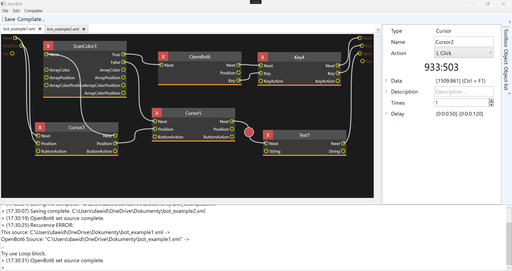
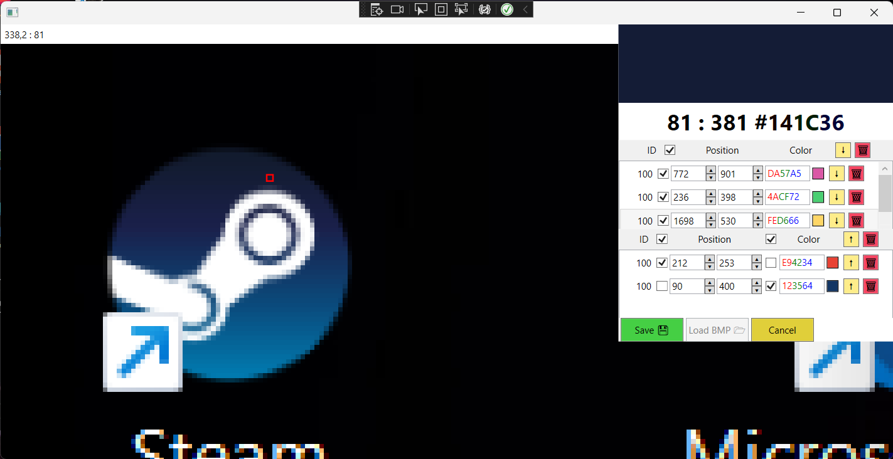

# BotEngine - Narzędzie do Tworzenia Bot'ów

BotEngine to zaawansowane narzędzie umożliwiające tworzenie botów, czyli automatów, które wykonują określoną sekwencję czynności na komputerze. Narzędzie jest zaprojektowane w sposób, który pozwala użytkownikom tworzyć boty za pomocą bloków, które można łączyć w węzły, ustalając tym samym kolejność wykonywania bloków oraz przesyłanie parametrów między nimi. Każdy blok ma funkcję opóźnienia przed wykonaniem akcji.

## Interfejs Użytkownika
BotEngine posiada intuicyjny interfejs użytkownika, który ułatwia tworzenie, edytowanie i uruchamianie botów za pomocą prostych operacji przeciągania i upuszczania bloków oraz łączenia ich w logiczne sekwencje. Dodatkowo, projekt BotEngine zawiera wbudowany kompilator oraz konsolę, w której użytkownicy mogą monitorować i otrzymywać kluczowe informacje odnośnie projektu.

## Funkcje i Bloki
Projekt obejmuje kilka kluczowych bloków:

### Cursor
Ten blok umożliwia przemieszczanie kursora myszy do określonego punktu na ekranie. Blok ten może wykonywać różne akcje, takie jak kliknięcie lewym lub prawym przyciskiem myszy, lub nie wykonywanie żadnej akcji.

### Text
Ten blok pozwala na wprowadzanie określonego tekstu na klawiaturze. Użytkownik może skonfigurować blok do pisania określonych fragmentów tekstu.

### ScanColor
Ten bardziej zaawansowany blok skanuje kolory pikseli na ekranie i podejmuje działania w zależności od wyników skanowania. Użytkownik może zdefiniować kilka kolorów, które muszą wystąpić na ekranie, i skonfigurować, jakie akcje mają być wykonywane w przypadku zgodności lub braku zgodności z określonymi kolorami.

### Key
Ten blok pozwala na symulowanie wciśnięcia lub puszczenia określonego klawisza na klawiaturze. Użytkownik ma kontrolę nad rodzajem akcji (wciśnięcie, puszczenie, kliknięcie) oraz wybór klawisza.

### OpenBOT
Ten blok umożliwia otwieranie wcześniej zapisanych botów i ich wykonywanie. Warto zaznaczyć, że wejścia i wyjścia są przekazywane między wczytanymi botami, co pozwala na integrację różnych automatów.

### CallToAPI
Ten blok służy do wysyłania zapytania do API. Użytkownik może wprowadzić zapytanie do API oraz zdefiniować, jakie wartości zwracać, czyli jakie wyjścia ma mieć blok.

## Zrzuty Ekranu
Poniżej znajdują się zrzuty ekranu z przykładami tworzenia i konfigurowania botów za pomocą narzędzia:
